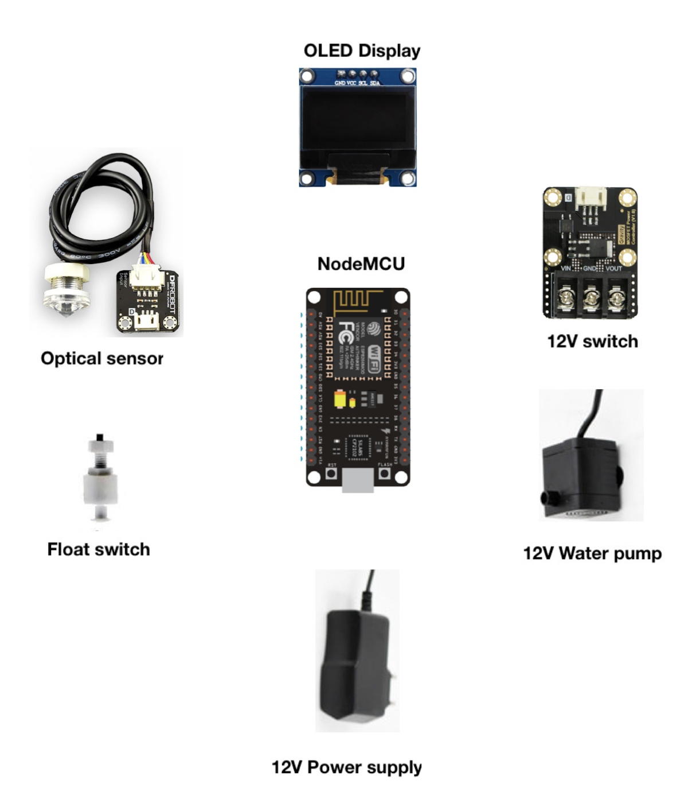

# Auto Top Off for Marine Aquariums

Open source hardware for an Auto Top Off (ATO) device to replenish freshwater in saltwater aquariums. 
The firmware is built with  ESPHome and all hardware parts can be sourced from web-sites such as eBay, Aliexpress and DFRobot.
This is a nice weekend project for the average tinkerer and is purposely designed to be easy to build, without special tools nor programming knowledge.


With this device, you can easily keep your aquarium at the perfect salinity level, making it a happy and healthy habitat for your marine life. 
So if you're looking for a fun weekend project that will also benefit your aquarium, look no further!




**Status**: beta testing

 ## Build & upload firmware
    `docker run --rm -v "${PWD}":/config -it esphome/esphome run open-ato-esp.yaml --device open-ato-esp.local`

 ## ESPHome Dashboard
    ```
    docker run --rm -p 6052:6052 -v "${PWD}":/config -it esphome/esphome dashboard config/
    open http://localhost:6052/
    ```

# Features
 * ATO with single float or dual float switch sensor and 12V freshwater pump (actuator/switch).
 * Customisable pump timeout.
 * Based on ESPHome firmware and consequently compatible with Home Assistant, MQTT, etc.
 * Over the air (OTA) updates
 * Mini OLED Display
 * Programming can be fully modified using a yaml file (no need for advanced programming skills)


# Parts list
 * NodeMCU v1.
 * NodeMCU shield with 12V input.
 * 2x float switches
 * Mosfet switch
 * Pump
 * mini Oled 0.96" display
 * Wires and connectors.
 
Tested with NodeMCU v1.0 boards.


# Backlog
* Evaluate the feasibility of writing tests
* CI Build?
* Instructions
  ** Fritzing Diagram
* 3D Printable enclosure

Developed by Franklin Dattein
Proudly sponsored by [InventMarine.com](http://inventmarine.com)